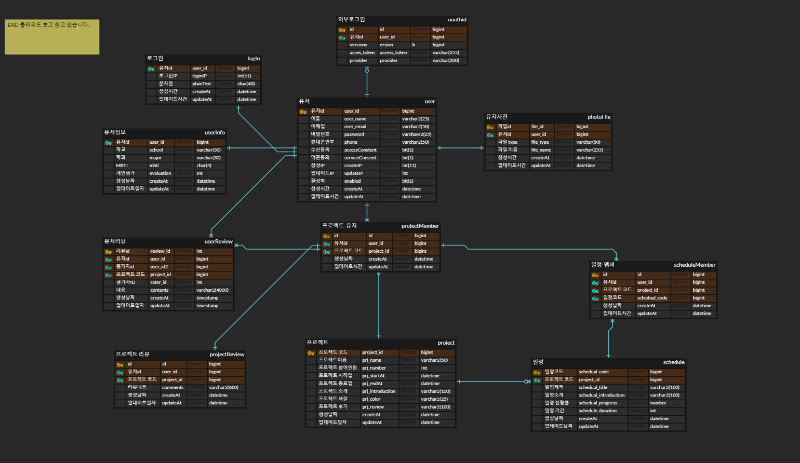

# Teamply_Node :memo:
Teamply 팀 node 입니다

<hr>

## DB 모델 :jeans:



 - 초기 db 설정 sql : Teamply_1_0.sql
 - 현재 db 설정 sql : Teamply_1_0.sql

## aws api 접근 경로

**url:** http://ec2-3-36-54-148.ap-northeast-2.compute.amazonaws.com:3000
**port:** 3000


## API 설계

## AUTH 

jwt를 이용한 방식
 - [x] signup
 - [x] accessToken
 - [x] refreshToken

## Feature

  - [ ] 로드밸런싱
  - [ ] Nginx 설정
  - [ ] 이메일 발송


## 설치 방법

- Ubuntu 기준입니다.

```
$ sudo apt update
$ sudo apt upgrade
$ sudo apt install git
$ git clone https://github.com/Ppangg/Teamply_Node.git
$ npm install 
$ sudo npm install -g pm2
$ pm2 start main.js
```

- Node.js 설치 방법
  https://github.com/nodesource/distributions/blob/master/README.md


- 기본 설정 포트가 8080이라서 aws의 경우 8080 인바운드/아웃바운드 포트를 열어주어야 잘 작동됩니다.